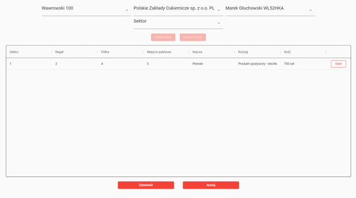

# System Obsługi Magazynu Logistycznego

#### *SQL Databases university coursework project*
### *Powered by [Avalonia UI](https://github.com/AvaloniaUI/Avalonia)*

## Cel:
System ma za zadanie gromadzić i prezentować dane związane z obsługą magazynu oraz automatyzować pracę pracowników poszczególnych działów.

## Zakres:
System zapewnia sprawniejsze prowadzenie dokumentacji przychodzących i wychodzących towarów, przyjmowania kierowców, obsługi klienta biznesowego oraz konfiguracji pracy pracowników magazynu. Pozwala na gromadzenie danych, ich prezentację oraz edycję.

## Kontekst:
System jest przeznaczony dla poszczególnych sektorów przedsiębiorstwa: departament obsługi klienta biznesowego, portiernia, pracownicy magazynu, kadra zarządzająca magazynem.

## Wymagania funkcjonalne:
- **Segment „Obsługa klienta”**:
  - Klient – nazwa firmy, NIP, transporty
  - Dodawanie, usuwanie, edycja i wyświetlanie w formie tabeli kontrahentów firmy
  - Generowanie raportów PDF dla każdego kontrahenta
- **Segment „Portiernia”**:
  - Kierowca – imię, nazwisko, nr rejestracyjny pojazdu, transporty
  - Dodawanie, usuwanie, edycja i wyświetlanie w formie tabeli kierowców
  - Generowanie raportów PDF dla każdego kierowcy
- **Segment „Panel zarządzania”**:
  - Magazynier – imię, nazwisko, pozycja, nr identyfikacyjny, transporty, sektor
  - Sektor – numer, miejsca paletowe, magazynier
  - Dodawanie, usuwanie i wyświetlanie w czytelnej formie sektorów magazynu
  - Dodawanie, usuwanie, edycja i wyświetlanie w formie siatki pracowników magazynu
- **Segment „Magazyn”**:
  - Transport – numer, rodzaj (import/eksport), data, magazynier, klient, kierowca, towary
  - Towar – nazwa, rodzaj, ilość, jednostka, transport-odbiór, transport-dostawa, miejsce paletowe
  - Dodawanie, wyświetlanie w formie tabeli lub w formie szczegółowej transportów przyjętych przez firmę

## Model Pojęciowy


## Model Logiczny


## Model Implementacyjny

```sql
CREATE TABLE Klienci (
    id_klienta UNIQUEIDENTIFIER CONSTRAINT PK_Klienci PRIMARY KEY,
    nip VARCHAR(12) NOT NULL CONSTRAINT UQ_Klienci_Nip UNIQUE,
    nazwa VARCHAR(55) NOT NULL,
);

CREATE TABLE Kierowcy (
    id_kierowcy UNIQUEIDENTIFIER CONSTRAINT PK_Kierowcy PRIMARY KEY,
    imie VARCHAR(55) NOT NULL,
    nazwisko VARCHAR(55) NOT NULL,
    numer_rejestracyjny_pojazdu VARCHAR(8) NOT NULL CONSTRAINT UQ_Kierowcy_NumerRejestracyjny UNIQUE,
);

CREATE TABLE Sektory (
    id_sektora UNIQUEIDENTIFIER CONSTRAINT PK_Sektory PRIMARY KEY,
    numer INT NOT NULL CONSTRAINT UQ_Sektory_Numer UNIQUE,
);

CREATE TABLE Magazynierzy (
    id_magazyniera UNIQUEIDENTIFIER CONSTRAINT PK_Magazynierzy PRIMARY KEY,
    id_sektora UNIQUEIDENTIFIER NOT NULL,
    numer_identyfikacyjny INT NOT NULL CONSTRAINT UQ_Magazynierzy_NumerIdentyfikacyjny UNIQUE,
    imie VARCHAR(55) NOT NULL,
    nazwisko VARCHAR(55) NOT NULL,
    pozycja VARCHAR(55),
    CONSTRAINT FK_Magazynierzy_Sektory FOREIGN KEY (id_sektora) REFERENCES Sektory(id_sektora)
);

CREATE TABLE Miejsca_paletowe (
    id_miejsca_paletowego UNIQUEIDENTIFIER CONSTRAINT PK_MiejscaPaletowe PRIMARY KEY,
    id_sektora UNIQUEIDENTIFIER NOT NULL,
    numer INT NOT NULL,
    regal INT NOT NULL,
    polka INT NOT NULL,
    CONSTRAINT FK_MiejscaPaletowe_Sektory FOREIGN KEY (id_sektora) REFERENCES Sektory(id_sektora)
);

CREATE TABLE Transporty (
    id_transportu UNIQUEIDENTIFIER CONSTRAINT PK_Transporty PRIMARY KEY,
    id_magazyniera UNIQUEIDENTIFIER NOT NULL,
    id_kierowcy UNIQUEIDENTIFIER NOT NULL,
    id_klienta UNIQUEIDENTIFIER NOT NULL,
    numer INT NOT NULL CONSTRAINT UQ_Transporty_Numer UNIQUE,
    data_czas DATETIME NOT NULL,
    rodzaj VARCHAR(6) NOT NULL,
    CONSTRAINT FK_Transporty_Magazynierzy FOREIGN KEY (id_magazyniera) REFERENCES Magazynierzy(id_magazyniera),
    CONSTRAINT FK_Transporty_Kierowcy FOREIGN KEY (id_kierowcy) REFERENCES Kierowcy(id_kierowcy),
    CONSTRAINT FK_Transporty_Klienci FOREIGN KEY (id_klienta) REFERENCES Klienci(id_klienta)
);

CREATE TABLE Towary (
    id_towaru UNIQUEIDENTIFIER CONSTRAINT PK_Towary PRIMARY KEY,
    nazwa VARCHAR(55) NOT NULL,
    rodzaj VARCHAR(55) NOT NULL,
    ilosc DECIMAL(10,2) NOT NULL,
    jednostka VARCHAR(55) NOT NULL,
    id_odbioru UNIQUEIDENTIFIER,
    id_dostawy UNIQUEIDENTIFIER NOT NULL,
    id_miejsca_paletowego UNIQUEIDENTIFIER NOT NULL,
    CONSTRAINT FK_Towary_MiejscaPaletowe FOREIGN KEY (id_miejsca_paletowego) REFERENCES Miejsca_paletowe(id_miejsca_paletowego),
    CONSTRAINT FK_Towary_Dostawy FOREIGN KEY (id_dostawy) REFERENCES Transporty(id_transportu),
    CONSTRAINT FK_Towary_Odbiory FOREIGN KEY (id_odbioru) REFERENCES Transporty(id_transportu)
);
```

## Opis Zaimplementowanych Funkcji Systemu:
  - Dodawanie/edytowanie/usuwanie kontrahentów + generowanie raportów PDF
  - Dodawanie/usuwanie sektorów
  - Generowanie raportów PDF dla każdego kontrahenta
  - Dodawanie/edytowanie/usuwanie magazynierów
  - Dodawanie transportów
  - Dodawanie towarów

## Moduły Systemu:
  1. Panel logowania <br/>
  
  2. Panel administratora <br/>
  
  3. Panel Portierni <br/>
  
  4. Przykładowy raport kierowcy <br/>
  
  5. Panel Obsługi Klienta <br/>
  
  6. Przykładowy raport kontrahenta <br/>
  
  7. Panel zarządzania - magazynierzy <br/>
  
  8. Panel zarządzania – nowy magazynier <br/>
  
  9. Panel zarządzania – edycja magazyniera <br/>
  
  10. Panel zarządzania – usuwanie magazyniera <br/>
  
  11. Panel zarządzania - sektory <br/>
  
  12. Panel zarządzania – nowy sektor <br/>
  
  13. Panel zarządzania – usuwanie sektora
  
  14. Panel magazyniera - eksporty <br/>
  
  15. Panel magazyniera – widok szczegółowy eksportu  <br/>
  
  16. Panel magazyniera – nowy eksport <br/>
  
  17. Panel magazyniera - importy <br/>
  
  18. Panel magazyniera – widok szczegółowy importu <br/>
  
  19. Panel magazyniera – nowy import <br/>
  

## Pomysły do Zaimplementowania:
  - Autoryzacja i autentykacja użytkowników
  - Raporty z transportów
  - Widok „mapy”
  - Możliwość przypisywania transportów tylko kierowcom obecnie obsługiwanym
  - Undo – przywracanie świeżo usuniętych rekordów (częściowo zaimplementowane poprzez kolumnę czy_usunieto)
  - ...

<br/>
<br/>
<br/>
<br/>
<br/>
<br/>

<footer>
    <p style="color: grey; font-size: 0.9em; font-style: italic">
        This project, including any associated files, names, and images, is intended for educational and demonstrative purposes only. The company name and logo featured in this project are purely fictitious. They do not represent any actual company, and any similarity to existing companies or trademarks is unintentional and purely coincidental.
        This project is not affiliated with, sponsored by, or endorsed by any real-world company. All content is provided "as is" without any warranties, express or implied. The author of this project do not assume any liability for any actions or consequences resulting from the use of this project.
    </p>
</footer>
<footer>
    <p style="color: grey; font-size: 0.9em; font-style: italic">
      Ten projekt, w tym wszelkie powiązane pliki, nazwy i obrazy, jest przeznaczony wyłącznie do celów edukacyjnych i demonstracyjnych. Nazwa firmy i logo przedstawione w tym projekcie są całkowicie fikcyjne. Nie reprezentują żadnej rzeczywistej firmy, a jakiekolwiek podobieństwo do istniejących firm lub znaków towarowych jest niezamierzone i czysto przypadkowe.
      Ten projekt nie jest powiązany z żadną rzeczywistą firmą, nie jest przez nią sponsorowany ani popierany. Cała zawartość jest dostarczana „tak, jak jest” bez żadnych gwarancji, wyraźnych ani dorozumianych. Autor tego projektu nie ponosi żadnej odpowiedzialności za jakiekolwiek działania lub konsekwencje wynikające z korzystania z tego projektu.
    </p>
</footer>